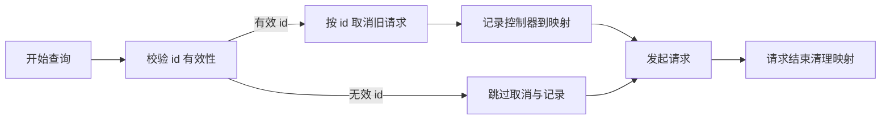

# 1. 问题

在 `WorkerHelper.query` 中，组件级请求取消以 `params.id` 作为键。当 `id` 缺失或为空字符串时，所有这类请求共享同一键，导致不同组件的并发请求会相互取消，出现误取消与隐性缺陷。

## 1.1. **键归一到空字符串导致跨组件误取消**
- 位置：`webpack/src/react/src/web-workder/workerHelper.ts` 第 49-55 行。
- 现状：将缺失或空的 `id` 归一为 `""` 并作为 `requestMap` 的键。
- 影响：多个组件在初始阶段或传参瑕疵下使用同一键，导致新请求会取消掉其它组件的进行中请求。

```ts
// 原始实现（节选）
const id = String(params?.id ?? '');
const controller = new AbortController();

// 新查询前取消旧请求（按组件 id）
WorkerHelper.requestMap.get(id)?.abort();
WorkerHelper.requestMap.set(id, controller);
```

- 问题点：当 `params.id` 为空、缺失或为仅空白字符串时，`id` 变为同一个键，触发跨组件误取消。

## 1.2. **请求结束未清理 requestMap，存在残留与膨胀风险**
- 位置：同文件的 `query` 函数。
- 现状：`requestMap` 在设置控制器后没有在请求结束时删除对应条目。
- 影响：长时间运行后，映射可能积累无用的 `AbortController`，增加内存占用与键命中概率（尤其在空键场景）。

## 1.3. **边界输入未约束与可观察性不足**
- 现状：对 `id` 的有效性（非空、非仅空白）缺少校验和日志提示。
- 影响：调用侧难以及时发现未传入有效 `id` 的问题，降低可维护性与问题定位效率。

# 2. 收益

整体收益：消除跨组件误取消的根源，提升请求取消语义的正确性与系统稳定性。

## 2.1. **降低误取消概率**
- 在 `id` 缺失时跳过同键取消或改用唯一键，可避免不同组件相互影响。
- 预计将误取消概率从当前不确定但可重复触发的情况降低到接近 **0**（仅在调用侧违反约定时可能出现问题）。

## 2.2. **提升可维护性与可测试性**
- 明确取消的分组边界：仅同一有效 `id` 的请求互斥。
- 通过输入校验与日志，调用侧更易发现并修复参数问题，集成测试更稳定。

## 2.3. **资源清理更规范**
- 在请求完成后删除 `requestMap` 条目，避免无用的控制器残留与键膨胀。

# 3. 方案

总体思路：对 `id` 做有效性校验，缺失或空白时跳过同键取消（或为该次请求生成唯一键但不参与跨请求取消）；同时在请求结束后清理 `requestMap`，增强稳定性与可维护性。

## 3.1. **实现步骤**
- 对 `params.id` 进行有效性判断：必须为非空且非仅空白的字符串才参与取消分组。
- 当 `id` 无效：
    - 方案 A（推荐）：跳过同键取消与 `requestMap` 记录，不影响其他组件。
    - 方案 B（可选）：为该次请求生成一次性唯一键，但该键不参与组件级取消接口。
- 在请求结束（成功或失败）后删除对应键的条目，避免残留。
- 为无效 `id` 的调用打印一次性 `warn`（或埋点），帮助调用侧尽快修复。

## 3.2. **修改前代码示例**
```ts
static async query<T = any>(type: string, params: any): Promise<T> {
  this.initWorker();

  const url = `/api/query/${type}`;
  const id = String(params?.id ?? '');
  const controller = new AbortController();

  WorkerHelper.requestMap.get(id)?.abort();
  WorkerHelper.requestMap.set(id, controller);

  const res = await fetch(url, {
    method: 'POST',
    headers: { 'content-type': 'application/json' },
    body: JSON.stringify(params),
    signal: controller.signal,
  });

  if (!res.ok) throw new Error(`request failed: ${res.status}`);
  const rawData = await res.json();

  if (type === 'table' || type === 'rich_text') {
    return rawData as T;
  }
  return await WorkerHelper.formatInWorker<T>(rawData, type, params);
}
```

## 3.3. **修改后代码示例**
```ts
static async query<T = any>(type: string, params: any): Promise<T> {
  this.initWorker();

  const url = `/api/query/${type}`;
  const idRaw = params?.id;
  const hasValidId = typeof idRaw === 'string' && idRaw.trim().length > 0;

  const controller = new AbortController();
  let keyUsed: string | null = null;

  if (hasValidId) {
    keyUsed = idRaw;
    // 仅同一有效 id 的请求互斥
    WorkerHelper.requestMap.get(keyUsed)?.abort();
    WorkerHelper.requestMap.set(keyUsed, controller);
  } else {
    // 可选：输出一次性警告或埋点，帮助定位调用问题
    // console.warn('query called without valid component id, cancellation is skipped');
  }

  try {
    const res = await fetch(url, {
      method: 'POST',
      headers: { 'content-type': 'application/json' },
      body: JSON.stringify(params),
      signal: controller.signal,
    });

    if (!res.ok) throw new Error(`request failed: ${res.status}`);
    const rawData = await res.json();

    if (type === 'table' || type === 'rich_text') {
      return rawData as T;
    }
    return await WorkerHelper.formatInWorker<T>(rawData, type, params);
  } finally {
    // 请求结束后清理映射，避免残留与膨胀
    if (keyUsed) WorkerHelper.requestMap.delete(keyUsed);
  }
}
```

- 解释：
  - `hasValidId` 保证只有非空且非仅空白的字符串才参与同键取消。
  - 无效 `id` 的请求不影响其他组件，也不会污染 `requestMap`。
  - `finally` 中删除映射，确保资源清理到位。

## 3.4. **流程示意图：现状 vs 目标**


以上图展示了当前流程的关键节点：当键来自空 id 时，不同组件会共享同一键，导致互相取消。同时请注意未做清理。



目标流程强调：只有有效 `id` 才参与互斥；无效 `id` 不影响其他组件；请求结束后进行清理。

# 4. 回归范围

从业务流程角度进行回归，重点验证请求取消的分组语义与稳定性。

## 4.1. 主链路
- 场景一：同一组件快速重复查询（有效 `id`）。
  - 预期：后发请求应取消前一次正在进行的请求；不影响其他组件。
- 场景二：两个不同组件并发查询，其中一个缺失 `id`，另一个 `id` 有效。
  - 预期：缺失 `id` 的组件请求不会取消另一个组件的请求；互不影响。
- 场景三：多个组件并发查询且 `id` 各不相同。
  - 预期：互不取消；各自独立完成。
- 场景四：请求正常完成与失败两种结局。
  - 预期：在两种情况下均应清理 `requestMap` 条目（针对有效 `id`）。

## 4.2. 边界情况
- `id` 为仅空白字符串。
  - 预期：视为无效，跳过同键取消与记录。
- 快速重复触发取消与重新发起（抖动场景）。
  - 预期：仅同一有效 `id` 的控制器被复用与取消；无交叉影响。
- `cancelQuery` 与 `cancelMoreQuery` 的行为。
  - 预期：仅对有效 `id` 生效；对无效 `id` 的请求不产生副作用。
- `terminate` 后的资源状态。
  - 预期：`worker`、`callbacks`、`requestMap` 均处于清空状态，无残留条目。
