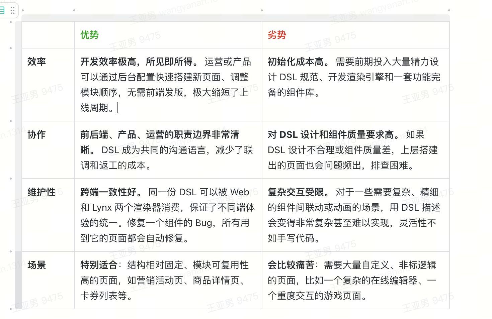
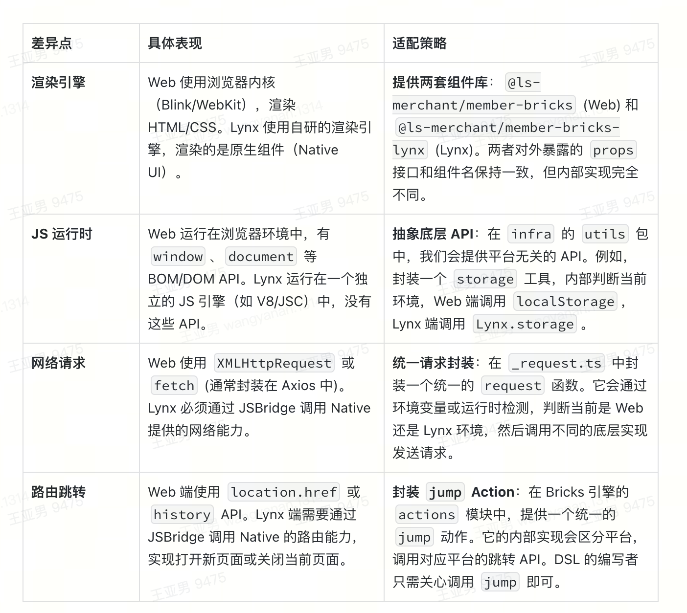

# https://aime.bytedance.net/chat/88ed5719-1fd3-493d-ac1d-e8948c0dcbce
一、整体架构与职责拆分
1. 你能整体讲一下会员营销前端的架构吗？应用仓库和基础组件仓库分别承担什么职责？
    1.1 一句话：会员前端采用 DSL 驱动的配置化架构 ，通过分层设计实现了页面动态配置、组件复用和跨端一致性，核心解决运营快速迭代和研发效率的问题

    1.2 架构:我们的架构采用 DSL（领域特定语言）驱动的分层设计，主要有四个层次
    - DSL层 - 配置化核心：这是我们架构的核心创新点，通过 DSL 将页面结构配置化。比如会员中心的会员卡、权益列表, 会员品feeds流商品，等组件都可以通过 DSL 配置，无需硬编码。前端只需要渲染 DSL 即可。"
    - 状态管理层 - MobX统一管理：我们用 MobX 来管理状态，DSL 基类封装了 DSL 拉取、数据装配等通用逻辑。每个页面继承这个基类，比如 MemberCenterStore 就继承它，实现页面特有逻辑。这样既保证了代码复用，又保留了扩展性。"
    - DSL生成层 - 动态渲染引擎：这是架构的关键环节。将 DSL 配置、业务数据和全局状态融合，生成最终可渲染的 DSL。这样实现了真正的动态渲染 - 数据变化时，DSL 会重新生成，页面自动更新。"
    - 渲染与事件层 - 解耦交互逻辑： "渲染层使用 BricksRender 组件，通过事件总线处理交互。这样组件和业务逻辑完全解耦，组件只负责展示，事件处理交给业务逻辑层。"
    1.3 完整的生命周期
    页面初始化
        ↓
    store.init() → 拉取 DSL + pageData + extraData
        ↓
    generateDsl() → 融合配置、数据、全局状态
        ↓
    store.create() → 首次渲染（FMP/曝光上报）
        ↓
    BricksRender → 渲染组件树
        ↓
    用户交互 → DSL 事件 → 业务处理 → 状态更新 → rerender
    1.4 优势缺点
    维度       技术实现               业务价值 
    配置化     DSL 驱动页面结构        运营自助配置，无需发版 
    组件复用   统一 bricksMap         组件库 多页面共享，减少重复开发 
    状态管理   MobX 响应式 + DSL 基类  数据变化自动更新视图 
    跨端一致   统一渲染引擎             Web/App 体验一致 
    可观测     错误上报 + 性能监控      线上问题快速定位
    缺点说学习成本、调试复杂度
 
    1.5 问题和挑战
    挑战 1：DSL 生成性能
    - 问题：数据频繁变化时，DSL 重新生成开销大
    - 解决：使用 MobX 的精确依赖追踪，只更新变化的部分；长列表使用虚拟滚动
    挑战 2：配置灵活性 vs 类型安全
    - 问题：DSL 配置容易出错，调试困难
    - 解决：增加 DSL 校验逻辑，错误统一上报；关键路径增加类型检查
    挑战 3：组件与业务逻辑耦合
    - 问题：早期组件里直接调接口，难以复用
    - 解决：组件只触发事件，业务逻辑统一到 event/index.ts 处理

    1.5 职责拆分
    - 应用仓库，负责具体业务场景的实现，包括dsl声明周期、业务逻辑、数据获取等。
    - 基础组件仓库，它包含了构成页面的所有基础元素和渲染它们的核心引擎。比如通用的 UI 组件、Bricks渲染引擎、dsl转换等。
    优势
    - 让业务开发更聚焦：c_mix 仓库的同学可以专注于快速变化的业务需求，而不用关心底层组件是怎么实现的。
    - 让基础能力更稳固：infra 仓库的同学可以精心打磨组件性能和渲染引擎的稳定性，一次优化，所有业务都能受益。
    这种拆分，或者说在同一个 Monorepo（大仓）内的分包策略，主要解决了三大问题：
    关注点分离（Separation of Concerns）：
    -  业务的归业务，技术的归技术。业务需求多变，迭代快；而基础技术追求稳定、通用。如果混在一起，业务的频繁变更可能会无意中破坏底层稳定性，反之，底层重构也可能无谓地阻塞业务开发。拆分后，二者可以按不同节奏演进。
    提升复用性与交互体验的一致性：
    - 所有业务场景（入会、会员中心、营销活动页）都依赖同一套 infra 组件库。这从根本上保证了不同页面的 UI 风格、交互体验和底层逻辑的一致性。想象一下，如果每个业务都自己实现一套按钮，那整个产品的体验将是灾难性的。
     清晰的权责边界与协作模式：
    - 拆分定义了清晰的“服务提供方”（infra）和“服务消费方”（c_mix）。当业务方需要一个新组件时，可以明确地向 infra 团队提需求。这种协作模式比在一个混乱的大泥球里各自为战要高效得多。

2. 这个项目在你看来，和传统“页面直写业务逻辑”的前端项目相比，最大的架构差异在哪里？
    最大的差异在于开发模式从“命令式”转向了“声明式”，核心是引入了 DSL 驱动的渲染引擎。
    - 命令式开发：业务开发需要在页面一步步画出组件。UI结构和业务逻辑是硬编码在代码里的。每次调整页面布局或显示/隐藏一个模块，都需要前端同学修改代码并发版。。
    - 声明式开发： 开发者（甚至非开发者）通过一份 JSON 格式的 DSL（领域特定语言），“声明”出页面“长什么样”。逻辑是这样的：“我想要一个页面，它包含一个会员卡片和一个优惠券列表”。 UI 结构是动态的，由后端下发。前端提供一个强大的 BricksRender 渲染器，它能读懂这份 DSL，并自动渲染出对应的组件。
    - 这个差异带来了根本性的改变：前端从“页面开发者”转变为“渲染引擎与组件提供者”，而页面搭建的工作则部分地交给了运营或后端，实现了真正的 Low-Code，大大提升了业务的迭代效率和灵活性。

二、Bricks DSL 与渲染引擎
1. 简单介绍一下你们的 Bricks DSL 是什么，核心元素有哪些？
    Bricks DSL (Domain Specific Language) 是一套用 JSON 定义的“蓝图”，它用来描述一个页面的完整结构、样式、数据和交互行为。它让我们可以把 UI 从代码中解放出来，变成一份可由后端动态下发、可配置的数据。
    核心元素包括：
    - name：组件类型（如 Text、Image、Button 等）
    - children（子组件数组，递归定义）
    - 表达式when：一个布尔值或一个 JS 表达式字符串，用于决定此组件是否应该被渲染。这是实现动态展示/隐藏的关键。
    - data: 静态 Props,给组件传递写死在 DSL 里的配置数据，比如按钮的文案、组件的样式。
    - style: 组件样式
    - 事件处理: 组件事件（如 onClick、onChange 等）
    - 渲染引擎注入的一些全局变量： $globalState, $brick, $ctx, $style

2. DSL → UI 的完整渲染链路是怎样的？从后端拿到一段 JSON，到前端渲染出页面，中间经历了哪些关键步骤和模块？等）？
    阶段一：数据预处理（在 bricks-dsl 包中）
        这一步的目标是生成一份“干净且数据完备”的 DSL，为渲染做准备。
        1. 获取数据：前端首先从后端 API 获取两份核心数据：页面的 DSL 结构 (JSON) 和页面的 业务数据源 DataSource (JSON)。
        2. 递归遍历 DSL：渲染引擎从 DSL 的根节点开始，深度优先遍历所有组件节点。
        3. when 表达式求值：在每个节点上，执行 when 表达式。如果结果为 false，该节点及其所有子节点将被从渲染树中“剪掉”，不再处理。
        4. 调用 Adapter：如果节点需要渲染，引擎会查找并调用与该组件匹配的 Adapter 函数。Adapter 会从庞大的 DataSource 中精准地提取、转换、格式化数据，生成一份该组件专用的、扁平化的 ViewModel。
        5. 数据注入：Adapter 返回的 ViewModel 会被合并回当前组件节点的 data 字段中。
    阶段二：组件递归渲染（在 bricks-render 包中）
        这一步是真正的 React 渲染过程。
        1. 启动渲染：BricksRender 组件接收到处理后的 DSL，开始递归渲染。
        2. 查找组件实现：对于每个 DSL 节点，根据其 name 属性，从一个预先注册的 bricksMap（组件名 -> React 组件的映射表）中找到对应的 React 组件。
        3. 实例化与渲染：将DSL节点中的data作为props传递给找到的React组件，并使用 React.createElement 创建实例。
        4. 递归渲染子节点：对当前节点 children 数组中的每个子节点，重复执行上述 2-3 步，最终构建出完整的 React 组件树。
    
    3. 你觉得用 DSL 驱动页面的优势和劣势分别是什么？在这个项目里，这种方式在哪些场景特别合适，哪些场景会比较痛苦？

    - 效率
    优势：开发效率极高，所见即所得。 运营或产品可以通过后台配置快速搭建新页面、调整模块顺序，无需前端发版，极大缩短了上线周期。
    劣势：初始化成本高。 需要前期投入大量精力设计 DSL 规范、开发渲染引擎和一套功能完备的组件库。
    - 协作
    优势：前后端职责边界非常清晰。 DSL 成为共同的沟通语言，减少了联调和返工的成本。
    劣势：对 DSL 设计和组件质量要求高。 如果 DSL 设计不合理或组件质量差，上层搭建出的页面也会问题频出，排查困难。
    - 维护性
    优势：跨端一致性好。 同一份 DSL 可以被 Web 和 Lynx 两个渲染器消费，保证了不同端体验的统一。修复一个组件的 Bug，所有用到它的页面都会自动修复。
    劣势：复杂交互受限。 对于一些需要复杂、精细的组件间联动或动画的场景，用 DSL 描述会变得非常复杂甚至难以实现，灵活性不如手写代码。
    - 场景
    特别适合：结构相对固定、模块可复用性高的页面，如营销活动页、商品详情页、卡券列表等。
    劣势：会比较痛苦：需要大量自定义、非标逻辑的页面，比如一个复杂的在线编辑器、一个重度交互的游戏页面。
4. 如果某个业务方想新增一种新组件类型，需要在 DSL/引擎侧做哪些扩展？有哪些约束和最佳实践？痛苦？
    - 创建组件代码 
    - （可选）编写 Adapter 
    - 注册到 bricksMap/actionMap
    - 提供类型定义 
    - dsl注册，并通过when表达展示场景

三、 架构中组件的交互和事情设计
1. 在这个架构中，组件之间的交互是怎么实现的。
组件之间不直接通信，而是通过事件总线 + Store 状态 + DSL 重新生成实现解耦交互，保证了扩展性和可维护性。
核心是“事件驱动 + 共享上下文”，组件本身不直接调用彼此，而是通过事件总线完成解耦通信。
    5.1. 事件总线（eventBus）作为组件通信中枢
    - 渲染上下文里注入 eventBus，BricksRender 会把它传递给组件
    - 组件触发事件 → eventBus 分发 → 业务侧统一处理
    - 典型事件：跳转、加载更多、支付、刷新、背景图变更
    参考： utils/dsl.ts
    5.2. 通过 Store 共享状态间接交互
    - 组件修改 store 状态 → MobX 响应式更新 → 其他组件感知状态变化
    - 比如背景图、标题栏样式变化由 store 控制，再由页面状态驱动布局更新
    参考： member_center.ts
    5.4. DSL 事件 + 数据更新形成闭环
    - 组件触发事件 → eventBus → 业务请求/处理 → 更新 dataSource → 重新生成 DSL
    - 页面通过 update 回调感知 dataSource 变化，实现“组件间联动”
2. 组件事件的怎么做的？
    DSL 声明事件
        ↓
    Brick 组件挂载时注册事件到事件总线，使用useRunOnce 确保只注册一次，避免重复注册。
        ↓
    dispatchActions 生成事件，通过props 传给组件
        ↓
    组件调用 props.onXxx(params)
        ↓
    ctx.emit 触发事件总线
        ↓
    命中 actionsMap 中对应的 Action 处理器
        ↓
    执行业务逻辑（跳转、埋点、改状态等）
3. 埋点事件和普通事件有什么区别？如何做到不侵入业务代码？
    特性           功能事件           埋点事件 
    前缀           component@       logEvent@ 
    注册时机        组件挂载时         组件挂载时（独立注册） 
    触发方式        组件调用 props     Action 内调用 invokeLogEvent 
    关注点          业务逻辑           数据上报

4. 如果页面有 1000 个组件，事件注册会有性能问题吗？如何优化？
回答思路：
- 懒注册：只有 when: true 的组件才注册事件
- 按需生成：事件 props 用 useMemo 缓存i
- 虚拟列表：只渲染可视区组件，减少注册量
- 事件委托：对于高频同类事件（如列表项点击），可考虑在父级统一处理

四、Adapter 层与数据模型
1. 这个项目中 Adapter 扮演什么角色？为什么需要一个单独的 Adapter 层，而不是直接在组件里处理 PSM 返回的数据？
    Adapter（适配器）在我们的架构中扮演着“数据翻译官”和“隔离层”的核心角色。它的唯一职责就是：将后端返回的、复杂的原始数据（PSM/DataSource），转换成前端组件需要的、纯净的、可直接使用的数（ViewModel）。
    之所以需要一个独立的 Adapter 层，而不是直接在组件里处理数据，是为了解决一个经典的前端痛点——前后端数据鸿沟。
    - 后端数据特点：通常是为业务逻辑服务的，结构复杂、嵌套深，而且可能包含很多前端不需要的冗余字段。
    - 前端组件需求：希望接收的 props 是扁平的、语义化的，只包含展示所需的数据，越纯净越好。
    如果没有 Adapter 层，组件代码将不得不包含大量的数据处理逻辑，这会带来灾难性的后果：
     组件被污染：一个本该纯粹的 UI 组件，被迫混杂了大量数据转换逻辑，变得臃肿且难以维护。
     脆弱的耦合：组件直接依赖后端接口的返回结构。一旦后端字段名或层级变了，前端所有用到这个字段的组件都得改，牵一发而动全身。
     复用性极差：一个为特定接口数据写的组件，很难直接用到另一个数据结构相似但不同的场景里。

3. Adapter 层在演进过程中遇到过哪些问题，比如字段膨胀、兼容老版本 DSL 等，是怎么解决的？
    随着业务发展，Adapter 层不可避免会遇到接口变更带来的挑战。我们的策略核心是向后兼容和最小改动。
    字段膨胀与瘦身：
    - 问题：新业务不断加新字段，Adapter 变得越来越臃肿。
    - 策略：定期对 Adapter 进行代码审查（Code Review）。我们会分析哪些字段是多个组件共用的，哪些是历史遗留但已无用的。对于不再使用的转换逻辑，果断移除。同时，鼓励将大型 Adapter 拆分为更小的、可组合的函数。
    兼容老版本 DSL/接口：
    - 问题：后端上线了新版接口，但老版本的 App 可能还在发旧版接口的数据，或者运营后台还存着旧版 DSL。
    - 策略：在 Adapter 内部做防御性编程和渐进式增强。

4. 如果后端 PSM 接口字段发生变更（新增/下线），前端这套 Adapter + DSL 的体系如何做到最小改动？决的？
    字段演进与最小改动原则
    - 问题：后端 PSM 接口字段发生变更（新增/下线/重命名）。
    - 策略：严格遵守“变更只发生在 Adapter 层”的原则。
    - 新增字段：如果只是新增展示，只需在 Adapter 中增加新的转换逻辑，并传递给 UI 组件。UI 组件可能需要增加一小块展示区域。
    - 下线字段：在 Adapter 中将该字段的处理逻辑移除，并确保返回的 ViewModel 中不再包含它。UI 组件侧如果该字段是可选的，应该能自然地不展示相关内容。
    - 重命名字段：这是最常见的场景。我们绝对不会去修改 UI 组件的 props 名字。唯一需要改动的就是 Adapter 内部，将读取旧字段名的地方，改成读取新字段名。
    通过这一系列策略，Adapter 层就像一个灵活的“减震器”，它将后端接口变化的冲击力化解于无形，保证了整个前端系统的稳定和迭代效率

五、Web 端应用架构（member-app）
1. member-app 的整体目录结构和模块划分是怎样的？路由、状态管理、页面级逻辑分别放在哪里？
    - 路由：作为一个 MPA 应用，它的路由是由文件结构天然决定的。
    - 状态管理：使用mobx管理全局状态，每个页面的store继承基础的dsl store，只关注自己的业务逻辑。
    - 页面级逻辑：每个页面都有一个对应的容器组件

2. Web 端是如何集成 Bricks 引擎的？在一个典型页面里，业务逻辑、数据获取和 DSL 渲染是如何协同的？
    App.tsx 就像一个“总导演”，它不关心具体要演什么（DSL 的内容），只负责在正确的时间（数据获取后），把“剧本”（DSL）和“演员表”（bricksMap）交给“舞台监督”（BricksRender），然后由 BricksRender 完成整个页面的搭建。

3. 在 Web 场景下，你们如何做权限、登录态或埋点这类全局能力的注入？
    全局能力的注入，主要通过渲染上下文（RenderContext）和请求封装两个机制来实现.
    1. 通过 ctx 注入全局能力：
    - 在每个页面的 App.tsx 中，我们会创建一个 ctx (Context) 对象，这个对象会贯穿整个渲染链路，并作为 props 的一部分传递给每个 Bricks 组件。
    - 我们可以把登录信息、用户权限、通用埋点函数等挂载到 ctx 上。

六、Lynx & 动态化（member-lynx / member-lynx-dynamic）
2. 同一份 DSL 在 Web 和 Lynx 上渲染时，会遇到哪些能力差异？你们采取了哪些适配策略？
    
    渲染引擎
    Web 使用浏览器内核（Blink/WebKit），渲染 HTML/CSS。Lynx 使用自研的渲染引擎，渲染的是原生组件（Native UI）。
    提供两套组件库：@ls-merchant/member-bricks (Web) 和 @ls-merchant/member-bricks-lynx (Lynx)。两者对外暴露的 props 接口和组件名保持一致，但内部实现完全不同。

    JS 运行时
    Web 运行在浏览器环境中，有 window、document 等 BOM/DOM API。Lynx 运行在一个独立的 JS 引擎（如 V8/JSC）中，没有这些 API。
    抽象底层 API：在 infra 的 utils 包中，我们会提供平台无关的 API。例如，封装一个 storage 工具，内部判断当前环境，Web 端调用 localStorage，Lynx 端调用 Lynx.storage。

    网络请求
    通过 JSBridge 调用 Native 提供的网络能力。
    统一请求封装：在 _request.ts 中封装一个统一的 request 函数。它会通过环境变量或运行时检测，判断当前是 Web 还是 Lynx 环境，然后调用不同的底层实现发送请求。

七、工程化与构建链路
1. 项目为什么选择 emo + Monorepo 的形态？在依赖管理、版本联动上有哪些收益和踩坑？
    我们选择 emo + Monorepo (单一代码仓库) 的架构，主要是为了解决在大型前端项目中普遍存在的团队统一开发规范，多包管理、协同开发和版本控制的难题。

    - Monorepo：指的是将多个相关的项目/包（比如我们的 member-app 和 infra-sdk）放在同一个 Git 仓库中进行管理。
    - emo：是字节跳动内部使用的一个 Monorepo 管理工具，类似于社区的 Lerna 或 pnpm workspace。
    这种形态带来了几个核心收益：
    1. 代码复用与可见性：
    - 所有代码都在一个仓库里，infra 层的任何改动对 c_mix 应用层都是立即可见的。开发者可以方便地在不同包之间跳转、查看和调试代码，极大地提升了开发体验。
    2. 简化的依赖管理：
    - 通过 emo 的 workspace:* 协议，我们可以轻松地实现内部包之间的引用。当 infra 库有更新时，member-app 无需发布、安装新版本，就能直接用上最新的代码。这对于本地联调来说是巨大的效率提升。
    3. 原子化的提交与版本联动：
    - 当一个需求同时涉及 infra 库和 c_mix 应用的修改时，我们可以通过一次 Git 提交完成所有改动。这保证了代码变更的原子性和一致性。CI/CD 工具也能更好地理解这种联动，实现 infra 和 c_mix 的同步构建和发布。
    4. 统一的工程规范：
    - 可以在仓库的根目录配置统一的 ESLint、Prettier、TypeScript 等规范，确保所有包都遵循同样的代码风格和质量标准。
    踩过的坑：
    - 构建时间变长：随着包越来越多，完整的构建和依赖安装时间会变长。我们需要依赖 emo 的缓存机制和按需构建命令（如 emo run build --scope=@ls-merchant/member-app）来优化。
    - 依赖地狱风险：不同包可能依赖同一个第三方库的不同版本，容易产生冲突。这需要我们在根 package.json 中通过 resolutions 或 overrides 字段来统一和锁定核心依赖的版本。

2. 简单说一下一个典型的开发/构建流程：从改一行代码，到本地启动调试，再到打包构建、CI 发布，中间都有哪些关键步骤和工具？踩坑？
    一个典型的生命周期，从改一行代码到最终上线，大致如下：
    1. 开发阶段：
    - git pull 拉取最新代码。
    - 在根目录执行 emo i，emo 会自动处理所有包的依赖安装和内部软链接。
    - 假设要开发 member-app 的一个新功能，执行 emo run dev --scope=@ls-merchant/member-app。这会单独启动 member-app 的本地开发服务器。
    - 在 VSCode 中修改代码，ESLint 和 Prettier 会提供实时的代码检查和格式化。
    2. 构建阶段：
    - 开发完成后，执行 emo run build --scope=@ls-merchant/member-app 来打包 member-app。
    - 这个命令会触发 member-app 内部的 edenx build 脚本。EdenX 会进行代码编译、压缩、代码分割、静态资源处理等一系列操作，最终在 dist 目录下生成生产环境的 HTML, JS, CSS 文件。
    3. CI 发布阶段：
    - 将代码 git push 到远程仓库，触发 CI/CD 流水线（如 Jenkins, GitLab CI）。
    - CI 服务器会自动执行 pnpm i 和 emo run build --filter=... 等命令，构建所有受本次提交影响的包。
    - 构建成功后，CI 会将 dist 目录下的产物上传到 CDN 或静态资源服务器。
    - 最后，通过发布系统将新版本的资源推向线上环境，用户即可访问到最新的页面。

3. EdenX 在这个项目中的角色是什么？有没有做过按路由/业务维度拆包之类的优化？
    EdenX 是字节跳动自研的前端工程化解决方案，你可以把它理解为一个集成了 Webpack/Rspack、开发服务器、构建命令等一系列工具的“瑞士军刀”。在 member-app (Web 端) 中，它扮演着构建核心的角色。

八、数据请求与错误处理
1. 前端调用会员相关 PSM 的典型链路是怎样的？请求封装层做了哪些通用能力（如签名、重试、熔断、埋点等）？
    典型链路：业务代码 (Store) → API 封装层 (apis/) → BAM 生成层 (apis/idl/) → 统一请求实例 (基于jsb) → jsb拦截器 → 后端 PSM
    
    请求封装层的通用能力：我们在 src/apis/_request.ts 的 Axios 实例上，通过拦截器（Interceptors）实现了丰富的通用能力：
    - 签名（Signature）/认证（Authentication）: jsb提供
    - 统一错误处理与埋点：在请求和响应中增加拦截器，拦截器打通监控平台，进行日志上报，我们会对所有返回结果进行预处理。如果后端返回的业务码 err_no 不为 0，说明业务逻辑出错。我们会统一弹窗提示用户（如“服务开小差了”），并将错误信息、请求参数、用户ID 等上报到监控平台，便于排查问题。业务代码的 catch 块无需再重复处理这些通用错误。
    对于成功的请求，也可以在这里统一记录 API 的耗时、成功率等性能埋点。
    - 熔断与重试（Circuit Breaking & Retry）：虽然本项目中更侧重在响应拦截器里做错误上报，但理论上也可以集成更复杂的策略。例如，可以引入 axios-retry 这样的库，在响应拦截器中判断如果请求是因网络抖动超时（ETIMEDOUT）或服务端临时不可用（503），则自动进行 1-2 次重试。

2. 对于接口错误/降级，你们在这个项目里是怎么做的？例如 DSL 渲染失败或关键数据缺失时，页面如何保证兜底体验？
    数据请求层降级：超时与重试、统一兜底页面
    数据处理层降级：防御性编程，在转换数据时，会做大量的非空判断和默认值处理
    渲染层降级：  
    - 关键数据缺失：如果获取页面的核心数据（比如整个 DataSource 或 DSL 本身）失败了，store.init() 会抛出一个错误。页面的根组件会捕获这个错误，并渲染一个全局的错误/空状态页面，引导用户刷新重试。
    - 组件级错误边界（Error Boundary）：我们的 Brick 渲染组件外部，包裹了一层 React 的 ErrorBoundary。如果某个组件（比如一个新开发的、有 Bug 的组件）在渲染过程中崩溃了，ErrorBoundary 会捕获这个错误，只让这个坏掉的组件渲染成一个错误提示，而不会导致整个页面白屏。这极大地提升了页面的健壮性。

3. 如果需要在 DSL 层做数据依赖（比如组件 B 依赖组件 A 的数据），这个项目里是怎么设计和实现的？
    这是一个很高级的场景，比如页面上有个品类选择器（组件 A），当用户选择品类后，下方的会员品列表（组件 B）需要根据选择的品类，重新请求数据并刷新。
    - 3.1 通过globalState实现数据通信
    在 globalState 中声明依赖状态
    组件 A (生产者) 更新 globalState
    组件 B (消费者) 监听 globalState 并重新请求数据
    通过这套“globalState 作为状态总线，action 作为状态修改器”的设计，我们就在 DSL 层面实现了组件之间的数据依赖和动态联动，而无需编写任何胶水代码。
    - 3.2 通过container组件实现数据通信
    container组件内部封装品类选择器相关逻辑，该组件的children组件配置ProductList组件，container内部手动调用Brick组件渲染ProductList组件, 注入品类选择器的状态，而ProductList组件内部处理展示商品列表、处理滚动加载更多等商品列表逻辑

九、性能与监控
1. 项目里采集了哪些关键性能指标（FCP/LCP/FMP 等）？这些指标在会员营销场景下分别代表什么含义？
    FP/FCP，LCP，FMP 等都是浏览器提供的性能指标，用来衡量页面加载速度和用户感知的渲染时间。
    - FCP（First Contentful Paint）：首次内容绘制，即浏览器渲染出第一个可见内容（如文本、图片、SVG 等）的时间。
    - LCP（Largest Contentful Paint）：最大内容绘制，即浏览器渲染出最大的可见内容（如图片、视频等）的时间。
    - FMP（First Meaningful Paint）：首次有意义绘制，即浏览器渲染出第一个有意义的内容（如主要的图片、文本块等）的时间。
    - tti（Time to Interactive）：首次可交互时间，即浏览器渲染出所有静态内容（如图片、文本等），并且所有用户交互事件（如点击、滚动等）都可以及时响应的时间。
    - customFmp（Custom First Meaningful Paint）：自定义首次有意义绘制时间，根据业务场景定义的有意义内容，来计算首次有意义绘制的时间。
    - totalCustomFmp（Total Custom First Meaningful Paint）：总自定义首次有意义绘制时间，即所有自定义有意义内容的绘制时间总和。

2. 你们如何衡量“这个 DSL 驱动的页面是否足够快”？在真实线上数据中遇到过哪些性能瓶颈，是怎么定位和优化的？含义？
    数据看板：我们会将上述性能指标上报到监控平台，并为核心页面（如入会页、会员中心）建立性能监控看板。我们会持续关注这些指标的 P90/P95 分位值，并设置报警阈值。一旦某个页面的 LCP 或 FMP 劣化超过 10%，相关负责人就会收到报警。
    自定义 customFmp：如上所述，通过在 DSL 中为关键业务组件（如入会按钮）添加 isFmp: true 标记，我们可以非常精准地衡量业务核心模块的加载速度。
3. 在监控侧，除了性能，还有哪些用户行为或异常数据是你们重点关注的？这些数据反过来如何指导架构或产品优化？
    监控不止于性能，更在于理解用户和发现问题。我们还重点关注以下两类数据：
    1. 用户行为数据（业务埋点）：    
        - 核心路径转化率：入会按钮的曝光 -> 点击 -> 成功入会的漏斗转化率。
        - 模块点击率 (CTR)：页面上各个模块（如不同权益、不同活动入口）的点击分布，了解用户对哪些内容更感兴趣。
        - 如何反哺：
            反哺产品：如果发现某个权益模块的 CTR 远低于预期，产品经理可能会决定调整它的样式、文案，或者干脆替换成别的权益。如果入会转化率低，可以分析是哪个环节流失的用户最多，从而进行针对性优化。
            反哺架构：如果发现用户经常使用的功能需要多次点击才能触达，我们可能会在架构层面考虑优化 DSL 结构，将高频功能前置。
    2. 异常数据（Sentry/平台监控）
      - 我们关注什么：
        - JS 错误：所有未被 catch 的 JS 异常。我们会对 JS 错误率设定报警，是衡量代码质量的重要指标。
        - API 错误：所有后端接口返回非 0 err_no 的请求。通过聚合分析，我们可以快速发现是哪个接口出了问题，影响了哪些页面。
        - 白屏/组件渲染失败：通过 ErrorBoundary 捕获的组件渲染失败事件。
      如何反哺：
        - 反哺架构：如果发现某一类 JS 错误频繁发生，比如 cannot read property 'xxx' of undefined，这通常意味着我们的 Adapter 或组件在处理可选链和默认值时不够健壮，需要进行系统性的加固。如果某个组件渲染失败率很高，说明该组件的代码质量需要重构。
        - 反哺研发流程：高企的 JS 错误率，可能会推动我们引入更严格的 Code Review 流程、更全面的自动化测试，或者在发布前增加灰度验证环节。
4. 稳定性保障点
一句话总结
 该会员项目通过“DSL 生成校验 + 运行时错误捕获 + 初始化兜底 + 白屏监控 + JSBridge 超时保护 + 接口监控 + 错误态 UI”构成完整的稳定性闭环，既保证线上可用性，也保证问题可追踪、可恢复
- 组件运行时错误捕获 ：BricksRender 提供 onCompRenderError，组件渲染异常会统一上报运行时错误，避免页面直接崩溃。 App.tsx + slardar.ts
- DSL 生成错误上报 ：DSL 生成阶段统一捕获配置/适配错误并上报，避免“页面结构错误导致白屏”。 member_center.ts
- 初始化错误兜底 + 白屏监控 ：initError 通过 eventBus 抛出，ErrorBoundary 捕获后展示兜底页，同时上报白屏信息，保证异常场景可感知可恢复。 ErrorBoundary
- 白屏插件与主动上报 ：slardar 集成 blankScreenPlugin，同时提供 sendBlankScreen 上报能力，提升线上白屏可观测性。 slardar.ts
- JSBridge 调用超时与异常上报 ：callJSB 封装超时机制，异常与超时统一上报，避免桥接异常导致页面不可用。 bridge.ts + slardar.ts
- 网络请求稳定性与监控 ：HTTP 层埋点请求延迟、响应上报，方便定位接口问题和性能瓶颈。 http.ts
- 错误态 UI 兜底 ：提供统一异常视图组件（重试/提示），保障用户可操作性。 ExceptionView

十、架构亮点与重难点追问
1. 在你看来，这个项目最有价值的架构亮点是什么？如果让你用两三句话说服一个新同学学习这套体系，你会怎么讲？
    我会这样对新同学说：
    “欢迎来到会员前端团队！我们这个项目最有价值的亮点，在于我们构建了一套自己的‘乐高’体系。
    你可能习惯了直接用 React 写页面的传统模式，那就像是‘用泥巴和木头从零开始盖房子’。而我们这里，工作模式完全不同：
    1. 我们不直接‘盖房子’，我们造‘乐高积木’。
    - 我们的核心工作，是在 infra 仓库里，开发一套套功能强大、性能卓越、样式统一的标准化组件（比如会员卡、优惠券、按钮等）。这些就是我们的‘乐高积木’。
    2. 我们用‘图纸’来组合‘积木’，而不是用代码。
    - 这张‘图纸’，就是我们的 Bricks DSL，一份描述页面长什么样的 JSON 文件。运营、产品甚至后端同学，都可以通过修改这份‘图纸’，来快速搭建和调整页面，而不需要我们前端介入。
    3. 我们有一个‘万能翻译机’（Adapter）。
    - 后端提供的数据（DataSource）往往是给机器看的，很复杂。而我们的‘积木’（组件）需要的数据很简单。这个‘翻译机’（Adapter）就负责把复杂的数据，自动翻译成‘积木’能懂的语言。
    所以，你的价值在于：你不再是一个页面的‘装配工’，而是一个‘乐高大师’和‘体系建设者’。你设计的每一个‘积木’（组件）、优化的每一毫秒渲染性能，都会通过这套体系，赋能给无数的业务场景，产生巨大的规模化效应。这就是我们这套架构最有魅力的地方。
2. 这套架构最大的复杂度/坑位在哪里？如果重新做一次，你会在哪些地方做不同的设计？
    这套架构最大的复杂度和“坑位”，主要集中在 DSL 的能力边界与表现力上，以及跨端实现的一致性上.

    最大的复杂度/坑位：
    1. 复杂交互的“DSL 噩梦”：
    - 问题：当需要实现非常复杂的组件间联动时（比如一个表单里，A 的值影响 B 的选项，B 的选项又决定 C 是否显示），用 when 表达式和 events/actions 链来描述，会让 DSL 变得异常复杂和难以维护，甚至出现循环依赖。这种声明式的描述，在处理命令式的、一步步的精细交互时，显得很“笨拙”。
    - 现状：我们目前通过 globalState 作为总线来解决，但当依赖关系复杂时，globalState 会变得臃肿，且难以追踪谁在什么时间修改了它。
    2. 跨端组件的“隐形差异”：
    - 问题：虽然我们努力让 Web (bricks) 和 Lynx (bricks-lynx) 两套组件的 props 接口保持一致，但底层的渲染机制和平台能力差异是客观存在的。比如，Web 端的 CSS 动画效果，在 Lynx 上可能无法 1:1 实现；Lynx 端的原生滚动优化，Web 端又没有。这些“隐形差异”导致有时同一份 DSL 在两端的实际表现会有细微差别，排查起来很困难。
    
    如果重新设计：
    1. 引入“逻辑编排层” (Logic Orchestration Layer)：
    - 我可能会考虑在目前的 DSL 体系之外，引入一个轻量级的“逻辑编排层”。对于简单的页面，继续使用纯 DSL。但对于那些交互逻辑特别复杂的场景，允许开发者编写一小段 JavaScript “逻辑脚本”，用更灵活的命令式代码来处理组件间的复杂通信和状态流转。
    - 这个脚本可以被 Form 组件或特定的容器组件加载，它能访问和操作 form-core 实例或 globalState。这样，我们就能在保持 DSL 简洁性的同时，为复杂场景提供一个“逃生舱口”，用代码的灵活性来弥补 DSL 表现力的不足。
    2. 推动更高层次的跨端统一框架：
    - 与其维护两套功能趋同但实现各异的组件库，我会探索是否能基于一些社区的优秀跨端方案（如 React Native for Web, Taro, Rax 等），构建一个更高层次的统一组件层。
    - 理想状态下，我们只编写一套组件代码，由框架在编译时，根据目标平台（Web/Lynx）将其编译成不同的产物。这能从根本上消除“隐形差异”，大大降低跨端维护的成本。当然，这需要非常大的前期投入和技术预研。
3. 你个人参与过程中，最难的一个技术问题是什么？你是如何分析、拆解并最终解决的？设计？
    我个人在项目中遇到的一个比较棘手的问题是首屏 FMP (首次有效绘制) 指标的批量优化。后续说你的性能优化就可以了
    你怎么知道慢，为什么慢，怎么解决慢
